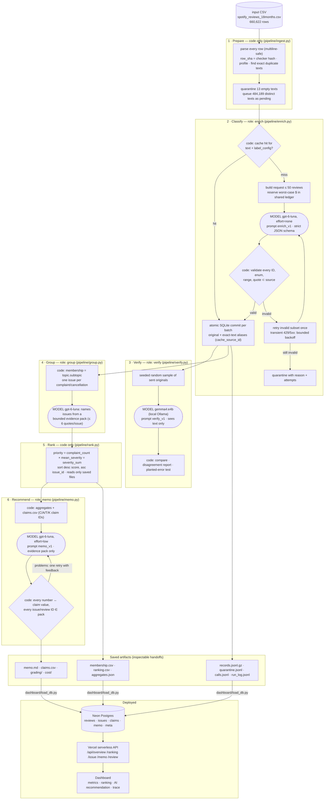

# Architecture

**Where code decides vs where a model judges**

| Step | Code (deterministic) | Model (language judgment) |
|---|---|---|
| Prepare | parsing, hashing, profiling, dedup, empty-text quarantine, queue | — |
| Classify | batching ≤ 50, budget reservation, ID/enum/range validation, quote membership, entity extraction (fixed term list), retries, cache reuse, statuses | topic.subtopic, intent, severity, sentiment, evidence span, needs_review |
| Verify | seeded sampling, comparison, planted errors | independent blind re-label (different model family) |
| Group | membership (topic.subtopic), evidence-pack selection, ID validation | short issue names/descriptions; flag off-topic examples |
| Rank | all arithmetic, tie-break | — |
| Recommend | aggregates, claims, number/ID checks, retry | weigh alternatives and write the argument |

**Stop / retry rules.** Enrich: invalid output → one retry of the failing subset, then quarantine with reason; transient errors →
≤ 4 backoff retries with jitter; 5 consecutive failed batches → stop; spend cap: refuse dispatch when spent + reserved + next
reservation > cap; Ctrl+C → finish in-flight batches, commit, snapshot, exit. Memo: one retry with the failed checks listed,
then save with `check.passed=false` (never silently).
